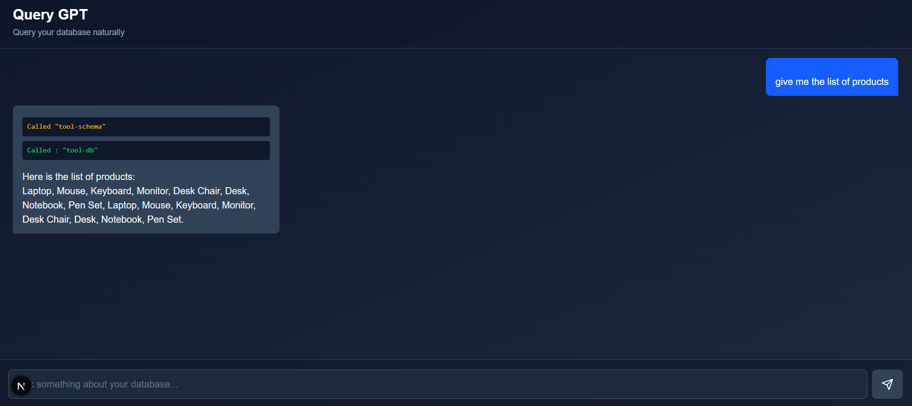

# Querygpt

A small Next.js + TypeScript project that integrates AI SDKs and Drizzle ORM for database access. It provides a Next.js app with an API route and database migrations/seeds configured.

# Demo


## Tech stack

- Next.js (App Router)
- React + TypeScript
- Drizzle ORM / drizzle-kit
- libSQL client (turso) (for cloud databases)
- AI SDKs: OpenAI and Google SDKs (via `@ai-sdk/*` packages)
- TailwindCSS (postcss + tailwind plugins present)

## Repository layout (important files)

- `app/` — Next.js app (App Router). Contains pages, API route(s) and styles.
- `db/` — Drizzle schema, migrations and seed script.
- `drizzle.config.ts` — Drizzle configuration.
- `package.json` — scripts and dependencies.

## Quick start

Requirements

- Node.js (recommended v18+)
- pnpm (used in this workspace)
- Optional: bun (the `seed` script uses `bun run ...` — see note below)

Install dependencies

```powershell
pnpm install
```

Run development server

```powershell
pnpm run dev
```

Build for production

```powershell
pnpm run build
pnpm run start
```

Lint

```powershell
pnpm run lint
```

